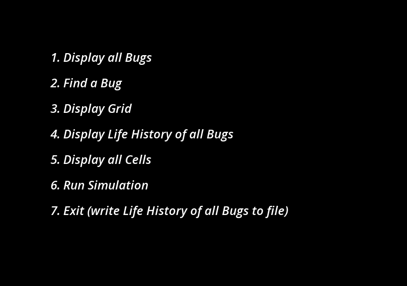
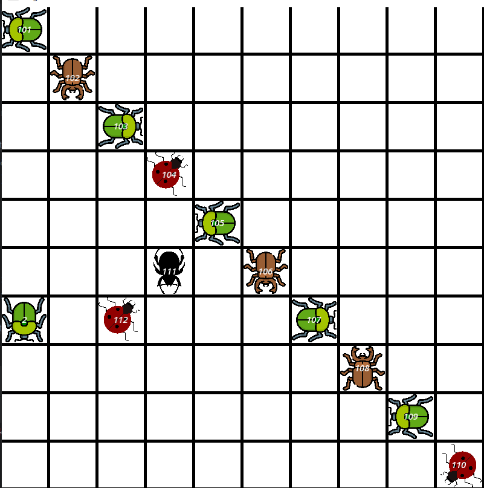
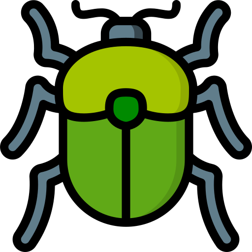
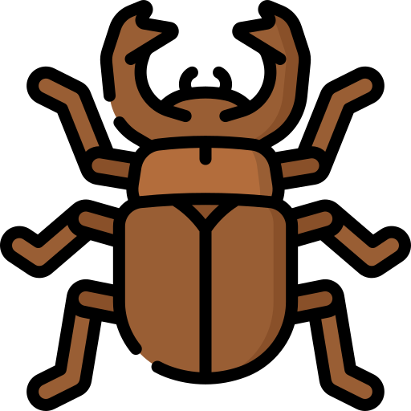
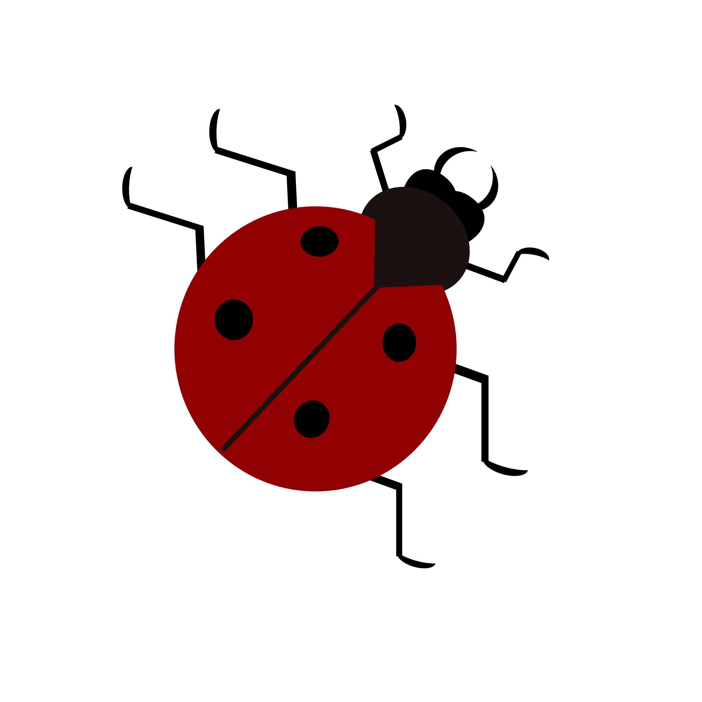
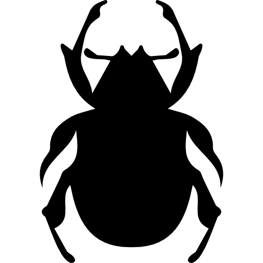

# Bug's Life (C++)

**Bug's Life** is a C++ application that simulates the movement and interaction of various bugs on a 10x10 grid Bug Board. The board supports different types of bugs with unique behaviors. When the board is tapped, all bugs move, potentially leading to interactions where bugs fight, and the largest bug eats the others.

## Screenshots

### Menu


### Board


### Crawler


### Hopper


### Diagonal Bug


### Super Bug


## Inputs

| Input       | Action                                    |
|:-----------:|:-----------------------------------------:|
| Q           | Return to the menu                        |
| Enter       | Search (in mode "Find a bug")             |
| Mouse Left  | 'Tap' the board                           |
| Up Arrow    | Scrolling (in mode "Life history", "all cells") or Move up super bug |
| Down Arrow  | Scrolling (in mode "Life history", "all cells") or Move down super bug |
| Left Arrow  | Move left super bug                       |
| Right Arrow | Move right super bug                      |

## Features

- **Bug Simulation**: Various bugs (Crawlers, Hoppers, Diagonal Bugs, Super Bugs) with unique behaviors move on a 10x10 grid.
- **Interactions**: Bugs that land on the same cell fight, and the largest bug eats the others.
- **Graphical Interface**: SFML is used for displaying the bug board and bug movements.
- **User Actions**: Users can initialize the board, display bugs, find specific bugs, and run simulations.
- **Life History**: Track and display the path taken by each bug.

## Bug Types and Movement

- **Crawler**: Moves by 1 unit in the current direction. If blocked, changes direction randomly until it can move.
- **Hopper**: Moves by a specified hop length. If blocked, changes direction randomly until it can move, or falls to the edge if it can't complete the hop.
- **Diagonal Bug**: Moves diagonally across the grid. If blocked, changes direction randomly until it can move.
- **Super Bug**: Can be moved independently using the arrow keys and interacts (fights) with other bugs.

## Installation Requirements

- C++ Compiler
- CMake
- SFML Library

## Installation and Setup Instructions

1. **Clone the repository:**
   ```bash
   git clone https://github.com/Roman-Manzhelii/Bugs-Life.git
   cd Bugs-Life
   ```

2. **Install SFML:**
   Follow the instructions to install the SFML library from the official [SFML website](https://www.sfml-dev.org/download.php).

3. **Set up SFML:**
   Ensure SFML is correctly installed and the path to the SFML library is set in your environment. For example, on Windows, you might set the `SFML_DIR` environment variable to the location of your SFML installation.

4. **Build the project using CMake:**
   Create a `build` directory and run CMake and make from there:
   ```bash
   mkdir build
   cd build
   cmake ..
   make
   ```

## Usage Instructions

1. **Initialize Board:**
   - Load bugs from `bugs.txt`.

2. **Navigate the Menu:**
   - Use the provided inputs to navigate through different options like displaying bugs, finding a bug, tapping the board, etc.

3. **Run Simulation:**
   - Start the simulation and observe the interactions and movements of the bugs.

## CMake Configuration

The project uses CMake for building. Below is the provided `CMakeLists.txt` file:

```cmake
cmake_minimum_required(VERSION 3.27)
project(Bugs_life)

set(CMAKE_CXX_STANDARD 14)
set(SFML_STATIC_LIBRARIES TRUE)
set(SFML_DIR H:/SFML/lib/cmake/SFML)

# Find SFML package
find_package(SFML COMPONENTS system window graphics audio network REQUIRED)

# Include SFML headers
include_directories(H:/SFML/include)

# Add executable
add_executable(Bugs_life
        src/header/Grid.hpp
        src/source/Grid.cpp
        src/source/main.cpp
        src/source/Bug.cpp
        src/header/Bug.h
        src/source/Crawler.cpp
        src/header/Crawler.h
        src/source/Hopper.cpp
        src/header/Hopper.h
        src/header/Hopper.h
        src/header/Game.h
        src/source/Game.cpp
        src/source/Game.cpp
        src/source/SuperBug.cpp
        src/header/SuperBug.h
        src/header/DiagonalBug.h
        src/source/DiagonalBug.cpp)

# Link SFML libraries
target_link_libraries(Bugs_life sfml-system sfml-window sfml-graphics sfml-audio)

# Include directories
include_directories(src/header)
```

## Authors and Contact

Developed by [Roman Manzhelii](https://github.com/Roman-Manzhelii). For more information or questions, please contact via email: romamanzheliy1@gmail.com.
